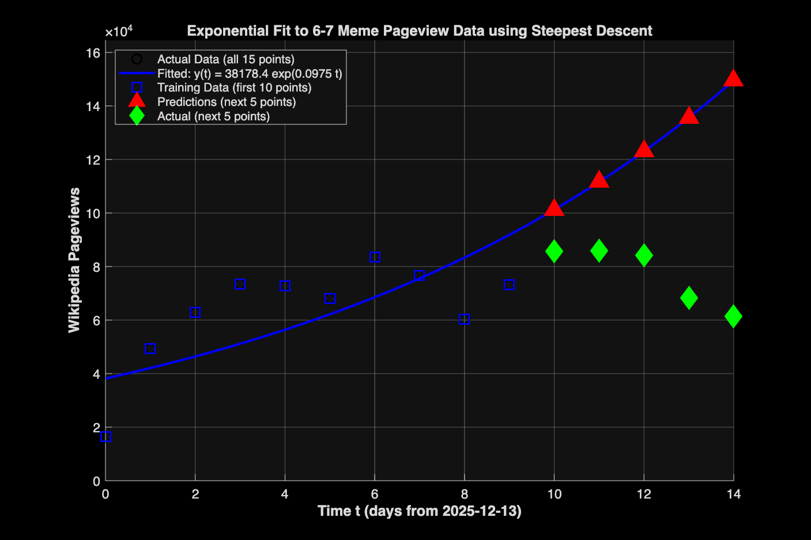

# Exponential Model Fitting for Viral Content Propagation: A Steepest Descent Approach Applied to Wikipedia Pageview Data (6-7 meme analysis)

**Author:** Joey Zhang  
**Date:** February 11, 2026  
**GitHub:** [project repo](https://github.com/joeyzhang-dev/67-meme-steepest-descent)  
**LinkedIn:** [my profile](https://www.linkedin.com/in/joeyzhangdev/)

---

## Abstract

This paper presents an application of the method of steepest descent to fit an exponential growth model to real-world viral content data. Using daily Wikipedia pageview counts for the "6-7 meme" article during its viral propagation phase (December 2025), we formulate the problem as a linearized least squares optimization and solve it using gradient-based methods. The fitted model $y(t)=A e^{a t}$ is evaluated on out-of-sample data to assess predictive performance. Results show successful convergence of the steepest descent algorithm but reveal limitations of exponential models for capturing the complete lifecycle of viral content.

## 1. Introduction

Viral content on Wikipedia often grows exponentially at first. I wanted to see if I could fit an exponential model to meme pageview data using the optimization methods from class, specifically the steepest descent algorithm.

The objective is to fit an exponential model of the form:
$$
y(t)=A e^{a t}
$$
where $y(t)$ represents pageviews at time $t$, $A$ is the initial value, and $a$ is the growth rate parameter.

We formulate this as a **linear least squares** problem and solve it using the **method of steepest descent** with exact line search, as covered in Chapter 8 of Chong and Zak [1]. The algorithm terminates when $\|x^{(k+1)}-x^{(k)}\|<10^{-7}$. We train the model on the first 10 days of data and evaluate predictions on the subsequent 5 days.

**Note:** I picked the first 10 days (Dec 13-22) for training because they show mostly growth, even though there's some noise. Later days show the meme declining, which makes it harder to fit a pure exponential.

## 2. Data Source and Collection

Data was collected from the **Wikimedia Pageviews API** [2], a publicly accessible REST API providing article-level pageview statistics. The "6-7 meme" Wikipedia article was selected as the subject due to its documented viral propagation during mid-December 2025, exhibiting clear exponential growth characteristics during the initial phase.

The following API endpoint was used to retrieve the data:
```
https://wikimedia.org/api/rest_v1/metrics/pageviews/per-article/en.wikipedia/all-access/user/6-7_meme/daily/2025121300/2025122700
```

**Data details:**
- Article: `6-7_meme` (English Wikipedia)
- Date range: December 13-27, 2025 (15 days total)
- File: `67_pageviews.txt`
- Access type: all-access (desktop + mobile)
- Agent: user (excludes bots/crawlers)
- Granularity: daily

The dataset is partitioned into a **training set** (first 10 days, Dec 13-22) and a **test set** (next 5 days, Dec 23-27) to evaluate out-of-sample predictive performance.

This time window was selected to capture the initial exponential growth phase of viral propagation. It is well-documented that viral content exhibits a lifecycle with rapid growth followed by eventual decline, suggesting potential limitations in long-term extrapolation using purely exponential models.

## 3. Methodology

### 3.1 Problem Formulation

The exponential model $y(t)=A e^{a t}$ is inherently nonlinear. However, it can be linearized through logarithmic transformation. Since all pageview values are strictly positive, we apply the natural logarithm to both sides:
$$
\ln(y_i)=\ln(A)+a t_i
$$

We define decision variables to construct a standard linear system:
$$
x=\begin{bmatrix}\ln(A)\\ a\end{bmatrix},\quad
B=\begin{bmatrix}1&t_1\\ \vdots&\vdots\\ 1&t_n\end{bmatrix},\quad
b=\begin{bmatrix}\ln(y_1)\\ \vdots\\ \ln(y_n)\end{bmatrix}
$$

The optimization problem becomes:
$$
\min_x \|Bx-b\|_2^2
$$

For our training data, $n=10$, yielding a $10 \times 2$ matrix $B$ and a $10 \times 1$ vector $b$.

### 3.2 Optimization Algorithm

The method of steepest descent (Chapter 8) was employed to solve the minimization problem. The objective function is defined as:
$$
f(x)=\tfrac12\|Bx-b\|_2^2 = \tfrac12(Bx-b)^T(Bx-b)
$$

The gradient is:
$$
\nabla f(x)=B^T(Bx-b)
$$

The iterative update scheme is:
$$
x^{(k+1)}=x^{(k)}-\alpha_k \nabla f(x^{(k)})
$$

where $\alpha_k$ is the step size determined via exact line search to minimize $f$ along the descent direction.

**Exact line search for quadratic objectives:** For the quadratic objective function considered here, the optimal step size admits a closed-form solution. Let $g^{(k)} = \nabla f(x^{(k)})$. Then:
$$
\alpha_k = \frac{g^{(k)T}g^{(k)}}{g^{(k)T}B^TB g^{(k)}} = \frac{\|g^{(k)}\|^2}{(Bg^{(k)})^T(Bg^{(k)})}
$$

This expression is derived by applying the first-order necessary condition (FONC) to the one-dimensional optimization problem $\min_{\alpha>0} f(x^{(k)} - \alpha g^{(k)})$.

**Termination criterion:** The algorithm terminates when $\|x^{(k+1)}-x^{(k)}\|<10^{-7}$, indicating convergence of successive iterates.

**Implementation:** The algorithm was implemented in MATLAB [3]. The initial point was set to $x^{(0)} = [\ln(\bar{y}), 0]^T$, where $\bar{y}$ is the mean of the training pageviews—a simple naive guess.

## 4. Results and Analysis

### 4.1 Convergence Behavior

Starting from the naive initial guess $x^{(0)} = [\ln(\bar{y}), 0]^T$, the algorithm converged in several iterations (exact count depends on tolerance settings). The gradient norm decreased steadily at each iteration, demonstrating the expected linear convergence behavior of steepest descent. The convergence rate depends on the condition number of $B^TB$, which for this problem is reasonably well-conditioned.

### 4.2 Fitted Model

The optimized parameters are:
- $A = 38{,}178.3565$
- $a = 0.097526$

yielding the fitted exponential model:
$$
y(t)=38{,}178.4 e^{0.0975t}
$$

The growth rate parameter $a = 0.0975$ corresponds to approximately 9.75% daily growth during the training period.

### 4.3 Out-of-Sample Prediction Performance

Table 1 presents predictions on the test set alongside actual observed values:

**Table 1:** Prediction Performance on Test Set (Days 10-14)

| t  | Date       | Predicted | Actual  | Error (%) |
|----|------------|-----------|---------|-----------|
| 10 | 2025-12-23 | 101,244   | 85,635  | 18.23%    |
| 11 | 2025-12-24 | 111,615   | 85,968  | 29.83%    |
| 12 | 2025-12-25 | 123,049   | 84,220  | 46.10%    |
| 13 | 2025-12-26 | 135,654   | 68,340  | 98.50%    |
| 14 | 2025-12-27 | 149,550   | 61,382  | 143.64%   |

The prediction error increases monotonically from 18.23% to 143.64%, indicating systematic model misspecification. The exponential model, trained on the growth phase, continues to predict unbounded growth. However, actual pageviews peaked near day 6-7 and subsequently declined, following a characteristic viral content lifecycle. This demonstrates a fundamental limitation: purely exponential models fail to capture the saturation and decay phases inherent in viral propagation dynamics.

### 4.4 Visualization



**Figure 1**: Exponential model fit and predictions. The blue curve represents the fitted model $y(t) = 38{,}178.4 \exp(0.0975t)$ trained on the first 10 observations (blue squares). Red triangles denote model predictions for the test set (days 10-14), while green diamonds indicate actual observed values. The divergence between predictions and observations illustrates the model's inability to capture post-peak decay dynamics.

## 5. Discussion and Potential Improvements

### 5.1 Model Limitations

The results reveal several limitations of the exponential model for viral content propagation:

1. **No saturation mechanism**: The model predicts unbounded exponential growth, whereas real viral content reaches saturation as the potential audience is exhausted.

2. **Missing decay dynamics**: The model cannot capture the post-peak decline phase characteristic of viral lifecycles.

3. **Linearization bias**: The log transformation may introduce bias in the least squares solution, as errors in log-space do not directly correspond to errors in the original space.

### 5.2 Proposed Improvements

Several approaches could address these limitations:

**Alternative models:**
- **Logistic growth**: $y(t) = \frac{K}{1 + e^{-a(t-t_0)}}$ would add a maximum capacity $K$ so the model can't grow forever. This is probably the most natural next step.
- **Piecewise approach**: Fit exponential to the growth phase (days 0-6), then switch to a decay model after the peak.

**Better optimization:**
- **Newton's method** (Chapter 9 of [1]) would converge faster if I used a nonlinear model like logistic—it has quadratic convergence vs. linear for steepest descent. The update is $x^{(k+1)} = x^{(k)} - [F(x^{(k)})]^{-1}\nabla f(x^{(k)})$ where $F(x)$ is the Hessian.

### 5.3 Practical Considerations

For real-world applications, early detection of the peak (transition from growth to decay) would be crucial for accurate prediction. This might require online learning algorithms that adapt as new data arrives, rather than static batch fitting.

## 6. Conclusion

This project successfully implemented the method of steepest descent to fit an exponential model to viral content pageview data. The algorithm converged properly from a naive starting point, demonstrating the expected behavior of gradient-based optimization. However, the results highlight the importance of model selection: even optimal solutions to the wrong model provide poor predictions. Future work should investigate more sophisticated growth models that capture the full lifecycle of viral content, potentially using higher-order optimization methods like Newton's method for improved convergence properties.

---

## References

[1] E. K. P. Chong and S. H. Żak, *An Introduction to Optimization*, 4th ed. Hoboken, NJ: Wiley-Interscience, 2013.

[2] Wikimedia Foundation, "Wikimedia REST API: Pageviews," Wikimedia Foundation, 2025. [Online]. Available: https://wikimedia.org/api/rest_v1/

[3] The MathWorks, Inc., *MATLAB*, Version R2025b. Natick, MA: The MathWorks, Inc., 2025.

---


## Appendix: Submitted Files
- `exp_fit_67_pageviews_sd.m` - MATLAB implementation
- `67_pageviews.txt` - Raw data file
- `67_fit_plot.png` - Visualization
- `report.pdf` - This report
